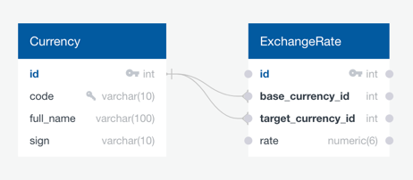

# Currency Exchange

Created according to the technical specifications presented in 
[this course](https://zhukovsd.github.io/java-backend-learning-course/Projects/CurrencyExchange/)

## Overview
REST API for describing currencies and exchange rates. 
Measuring and a large number of lists of currencies and exchange rates, 
and performing calculations for the conversion of one total amount from one currency to another.

## Tech Stack

- Java 17
- Servlets
- JDBC
- PostgreSQL
- Maven


## Database Diagram



## API Reference

### Currency

#### Getting the list of currencies

```http
  GET /currencies
```

Example of response:

```json
[
  {
    "id": 0,
    "name": "United States dollar",
    "code": "USD",
    "sign": "$"
  },
  {
    "id": 1,
    "name": "Euro",
    "code": "EUR",
    "sign": "€"
  },
  "..."
]
```

#### Receiving a particular currency

```http
  GET /currencies/${currency_code}
```

| Variable        | Type     | Description                 | Example |
|:----------------|:---------|:----------------------------|---------|
| `currency_code` | `String` | code of particular currency | USD     |

Example of response:

```json
{
  "id": 1,
  "name": "United States dollar",
  "code": "USD",
  "sign": "$"
}

```

#### Adding a new currency to the database

Data is passed in the request body in the form fields (x-www-form-urlencoded).
Form fields - name, code, sign

```http
  POST /currencies
```

Example of response:

```json
{
  "id": 1,
  "name": "United States dollar",
  "code": "USD",
  "sign": "$"
}
```

### Exchange Rate

#### Getting a list of all exchange rates

```http
  GET /exchangeRates
```

Example of response:

```json
[
  {
    "id": 0,
    "baseCurrency": {
      "id": 0,
      "name": "United States dollar",
      "code": "USD",
      "sign": "$"
    },
    "targetCurrency": {
      "id": 1,
      "name": "Euro",
      "code": "EUR",
      "sign": "€"
    },
    "rate": 0.99
  },
  "..."
]
```

#### Getting a particular exchange rate

```http
  GET /exchangeRate/${pair_currency_code}
```

| Variable             | Type     | Description                                   | Example |
|:---------------------|:---------|:----------------------------------------------|---------|
| `pair_currency_code` | `String` | pair of codes of currencies for exchange rate | USDEUR  |

Example of response:

```json
{
  "id": 0,
  "baseCurrency": {
    "id": 0,
    "name": "United States dollar",
    "code": "USD",
    "sign": "$"
  },
  "targetCurrency": {
    "id": 1,
    "name": "Euro",
    "code": "EUR",
    "sign": "€"
  },
  "rate": 0.99
}
```

#### Adding a new exchange rate to the database

Данные передаются в теле запроса в виде полей формы (x-www-form-urlencoded).
Поля формы - baseCurrencyCode, targetCurrencyCode, rate

```http
  POST /exchangeRates
```

Example of response:

```json
{
  "id": 0,
  "baseCurrency": {
    "id": 0,
    "name": "United States dollar",
    "code": "USD",
    "sign": "$"
  },
  "targetCurrency": {
    "id": 1,
    "name": "Euro",
    "code": "EUR",
    "sign": "€"
  },
  "rate": 0.99
}
```

#### Updating the existing exchange rate in the base

The currency pair is specified by consecutive currency codes in the request address.
The data is passed in the request body in the form fields (x-www-form-urlencoded).
The only form field is rate.

```http
  PATCH /exchangeRate/${pair_currency_code}
```

| Variable             | Type     | Description                                   | Example |
|:---------------------|:---------|:----------------------------------------------|:-------:|
| `pair_currency_code` | `String` | pair of codes of currencies for exchange rate | USDRUB  |

Example of response:

```json
{
  "id": 0,
  "baseCurrency": {
    "id": 0,
    "name": "United States dollar",
    "code": "USD",
    "sign": "$"
  },
  "targetCurrency": {
    "id": 1,
    "name": "Euro",
    "code": "EUR",
    "sign": "€"
  },
  "rate": 0.99
}
```

### Currency Exchange

Calculation of transferring a certain amount of funds from one currency to another

```http
  GET /exchange?from=${BASE_CURRENCY_CODE}&to=${TARGET_CURRENCY_CODE}&amount=${AMOUNT}
```

| Parameter              | Type     | Description                    | Example |
|:-----------------------|:---------|:-------------------------------|:-------:|
| `BASE_CURRENCY_CODE`   | `String` | currency code for first value  |   USD   |
| `TARGET_CURRENCY_CODE` | `String` | currency code for second value |   RUB   |
| `AMOUNT`               | `int`    | sum of amount                  |  10.00  |